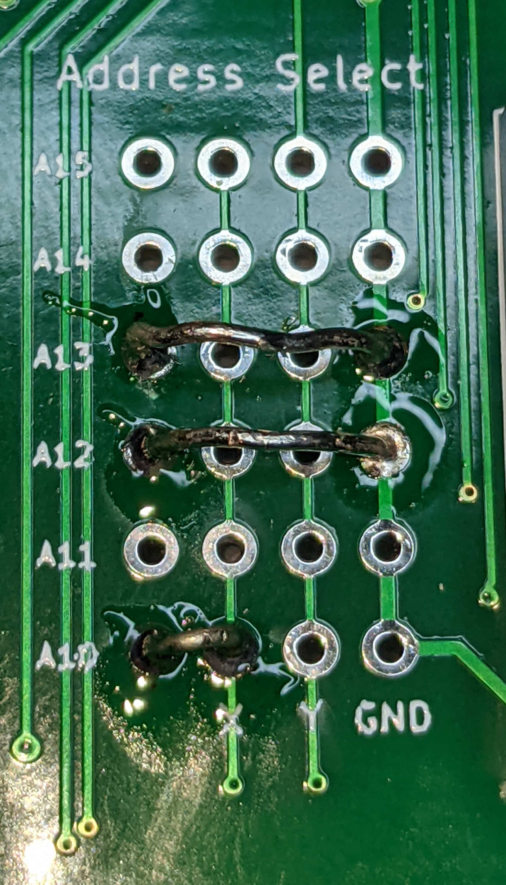
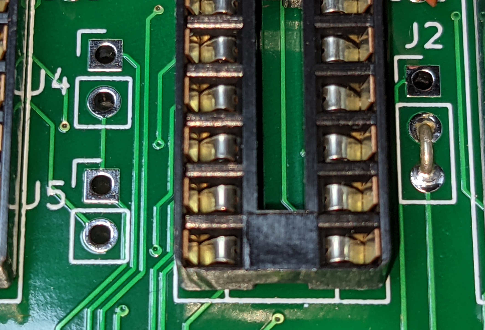

# Board Assembly
The VDM-2021 is assembled from a partial kit, which includes all of the components not readily available:

- 1 x VDM-2021 PCB
- 1 x Character generator ROM (either MCM6574P or MCM66740)
- 8 x 2102 memory chips (equivalent to the 91L02 or 21L02)
- 1 x DM8131 bus comparator
- 1 x DS8836N bus receiver
- 1 x 93L16 binary counter
- 1 x heat sink
- 1 x BNC PCB connector 

The remaining components can be ordered from Jameco, Mouser, or Digikey.  A Bill of Materials (BOM) can be found [here](https://docs.google.com/spreadsheets/d/192WKFjCJ90pev5cdcXky_RTGSZf7UaUfQrNFE1YifAw/edit?usp=sharing) which includes every Jameco part number.  Jameco has a "Quick Order" form under the ordering drop down which will allow for quick entry of the BOM part numbers.  At the time of writing, the total order from Jameco is $74.55 if you have none of the parts on hand.

## Assembly Overview
Before beginning assembly, it is highly recommended that you skim through the excellent board assembly directions from the [original VDM-1 manual](history/manuals/manual%20rev%20C.pdf).

There are a few major things that are different when compared to the original assembly directions:

- The bypass capacitors have different reference identifiers.
- The location of the components are entirely different, but the reference identifiers are the same (e.g. IC22 is the same component for the VDM-1 and VDM-2021).
- There is no ribbon cable.
- The address select jumper has a different order.  The VDM-1 address select is ordered "Address Select", "GND", "X", "Y", whereas the VDM-2021 address select jumper is ordered "Address Select", "X", "Y", "GND".  Just be mindful of the silkscreen and you'll be fine.

An interactive Bill of Materials can be [found here](ibom.html).  It is highly recommended to use this as a reference during assembly.  Since the component references correspond to the original VDM-1 circuit, the references are somewhat randomly placed on the board.  The interactive BOM is a quick and easy way to find where a part goes on the board.

## Recommended Steps (Soldering)

1.  Install all resistors (you can skip R6 if using MCM667400 char ROM).  Proceed in order of resistor value rather than reference, and use the [interactive BOM](ibom.html).  Filter by one resistor value at a time, and the BOM will highlight all locations on the board.  It's easiest to install the 1.5K resistors last (as you'll basically be filling every resistor).  All resistors (except R6) are 1/4 watt and should have leads bent as close to resistor body as possible.  R6 is 1/2 watt.
2.  Install DIP sockets.
3.  Install DIP switch.  Note that switch 1 should be towards the S-100 bus, and switch 6 should be near the edge of the board.
4.  Install Q1, D2, D3, and XTAL.
5.  Install optional BNC connector.  Note that there are 4 possible orientations depending on your needs.  You can mount it on the front or back of the PCB, and point it up or to the side.  Also note that it takes a long time to get the BNC connector sufficiently hot.  I recommend applying the solder iron to the four outer ground connections repeatedly, while avoiding directly heating the pad, until the connector is sufficiently hot to solder.
6. If using MCM6574P or MCM6571AP (RECOMMEND SKIP IF USING MCM667400):  Install R6, D1, C7, C8, C9, IC50 (12V regulator)
7. Install heat sink and voltage regulator.  I recommend using thermal paste between the heat sink and the board as well as the heat sink and the voltage regulator.  Depending on the 8V rail voltage in your system, this regulator will be dissipating a lot of heat.  Most of the heat should be radiated with the heat sink, but the back of the board also helps.  The original VDM-1 had a larger heat sink, and Lee Felsenstein wanted to make sure there was sufficient heat dissipation in the VDM-2021 design.  If possible I strongly recommend using a 7805 rated for 1.5 amps (the board draws about 600ma on average).
8. Install C4 -- tantalum 1uf.  The long lead (positive) goes in square pad.
Install C39 -- tantalum 15uf.  (PLEASE NOTE THAT THIS IS *NOT* POINTING IN THE SAME DIRECTION AS C4)
Install all capacitors others than C7, C8, C9.
9. Install Jumpers.  For default configuration as in original VDM-1 (no vector interrupt, CC00h memory address, C8 I/O status port), set jumpers as shown here:
{:width="100px"}
{:width=100px"}

## Integrated Assembly-Test Steps
Your board should now be completely soldered, but it is recommended that you follow these steps for populating the board and testing it as you go along.  In my instructions, I assume you'll do these tests on a bench with a power supply, but you can also perform the tests by putting the partially assembled card into the s-100 bus.

1. Jumper the input of the voltage regulator to a power supply.  Be very careful to respect the correct polarity.  I may have accidentally blown up the 15uf tantalum capacitor before.  Ground is the center pin, and the unregulated voltage is the left pin.

2. Verify VCC and GND voltages on a few sockets.
3. Turn the power off and install the following ICs:
    - IC1: 7406
    - IC2: 74LS163
    - IC7: 74LS20
    - IC8: 93L16 (from kit)
    - IC9: 74LS10
    - IC14: 74LS02
    - IC15: 74LS00
    - IC16: 74LS109
    - IC19: 74LS04
    - IC20: 74LS163
    - IC21: 74LS163
    - IC22: 74LS163
4. Turn the power on and check timing chain operations.
    - IC19 Pin 3 / Pin 4:  This is the waveform from the xtal oscillator circuit.  It should be noisy sine wave or triangular wave of frequency 14.318mhz.  The details depend on the 74LS04 you use in IC19.  Note some perfectly good 74LS04 chips fail to oscillate in this circuit -- I'm not sure why.  I've just chosen a different brand 74LS04 to resolve the problem.  Note I've also noticed the oscillator fail to oscillate if Vcc was insufficient due to an inadequate supply voltage to the power regulator (in one case it was failing to oscillate, and Vcc was at 4.5V)
    - IC20 Pin 12:  Should be square wave with 350ns on / 280 ns off.  For me I get those values almost exactly if I measure at about Y=1V, but as long as the total period is close to 630ns you should be in good shape.
    - IC15 Pin 6:  Should be normally high with short low pulses every 63us.
    - IC2 Pin 11: Clean square wave with period 828us.  High 316us, low 512us.

5. Turn the power off and install the following ICs:
    - IC12 74LS86
    - IC25 4049 (Caution -- sensitive to static discharge)
    - IC30 4001 (Caution -- sensitive to static discharge)
    - IC3 74166
    - IC4 Character ROM (MCM6574 or MCM66740, included in kit)
    - IC5 74LS175
    - IC6 74LS175
    - IC10 74LS109
    - IC17 74LS175

6. Test video circuit:
    - Theory of this test: In this test you'll be jumpering some of the blanking circuits to pass all video through.  With no video memory installed, the character generator will create underscores.
    - Temporarily jumper IC17 Pin 5 to Pin 8 and IC7 Pin 4 to Pin 14
    - Turn DIP 2 and 5 on, all other DIP switches off
    - Connect the video output from the card to a CRT monitor.
    - Turn on power.  You should see a page full of underscores.  If you adjust the two trimmer pots you should be able to move the page left/right and up/down.
    - You may need to adjust the vertical/horizontal hold on your monitor.  (There are steps for this in the original VDM-1 manual, but I've never found it to be necessary)

7. Final Assembly 
    - Remove all temporary jumpers installed in previous test.
    - IC 11 74LS138
    - IC 13 74LS109
    - IC 18 74LS132
    - IC 23, 24, 28 74LS157
    - IC 26, 27 4029 (Caution -- sensitive to static discharge)
    - IC 29 8131 (included in kit)
    - IC 31, 32 4042 (Caution -- sensitive to static discharge)
    - IC 33, 34 74LS08
    - IC 35 74LS00
    - IC 36 74LS04
    - IC 37 8836 (included in kit)
    - IC 38, 39 74LS367
    - IC 40 74LS10
    - IC 41-48 2102 (included in kit)
    
  
8. (Work in progress) Test the final board.
    - Install board in computer.
    - Through monitor program enter ascii characters from CC00-CFFF.  Write 0 to port C8.  This should scroll the characters to the top of the screen.
    - Test the status port.  Write various values to the port.  The four most significant bits should control where on the screen the first line is displayed.  The four least most significant bits should control which row of video memory is displayed first.
    - If the status port correctly adjusts the scroll, and the contents of the video memory get displayed, then your video card is fully functional.

Note: One failure mode I've observed was that when using a cheap 7805 rated at 1 amp, once the full board is populated the current draw can be too large for the regulator to keep up with.  It's entirely possible this is only a concern with counterfeit 7805s -- I can't be certain.  You'd observe this by seeing Vcc below 4.7 amps.  This can cause the oscillator to fail to oscillate once the board is fully populated, even though it passed the earlier test.  (So the lesson is use a high-quality 7805, such as an L7805CV or L7805ABP)

[Return to Main Page](index.md)

